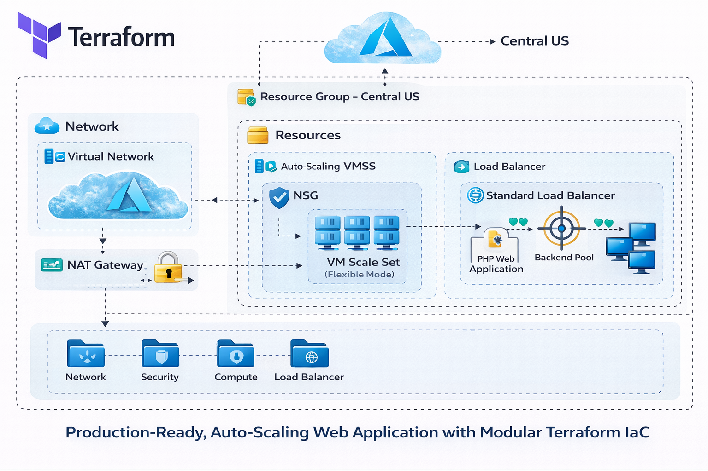

# 🚀 Scalable Azure Web App Infrastructure with Terraform

### **VM Scale Set (Flexible Mode) • Load Balancer • NSG • NAT Gateway • Cloud-Init • Remote Backend**

This project deploys a **production-ready, auto-scaling web application infrastructure** on **Microsoft Azure** using **Terraform**.  
It showcases industry best practices for building secure, scalable, and fully automated cloud environments suitable for modern enterprise workloads.

---

# 📌 **Architecture Overview**

```
(Insert your azure_vmss_architecture.png here)
Or use:

```

### **Components Included**
- **Azure Virtual Machine Scale Set (Flexible Orchestration Mode)**
- **Standard Load Balancer**
- **Virtual Network + Subnet**
- **Network Security Group (NSG) with Least Privilege Rules**
- **NAT Gateway for Outbound Internet**
- **User-Data (cloud-init) Bootstrap Script**
- **Remote Terraform State (Azure Blob Storage Backend)**
- **Tagging Strategy via Variables + Locals**

---

# 🎯 **Key Features**

### ✅ **Production-Ready Architecture**
- Highly available VMSS behind a Standard LB  
- Secure subnet-level NSG  
- Predictable outbound IP with NAT Gateway  

### ✅ **Infrastructure as Code (IaC) Best Practices**
- Provider + Terraform version pinning  
- Remote backend with state locking  
- Reusable variables and computed locals  
- Dynamic NSG rule generation  
- Environment-aware VM sizing  
- Lifecycle rules for autoscale compatibility  

### ✅ **Secure Linux VM Access**
- SSH Public Key Authentication (no passwords)  
- Private keys never stored in repo  
- Cloud-init setup executed at first boot  

### ✅ **Automated App Deployment**
- Installs Apache, PHP, and dependencies  
- Deploys sample PHP application  
- Displays Azure Instance Metadata (IMDS)  

---

# 🗂️ **Project Structure**

```
│── backend.tf               # Azure Blob Storage backend
│── provider.tf              # Terraform + AzureRM provider versions
│── variables.tf             # Input variables
│── locals.tf                # Computed and reusable values
│── rg.tf                    # Resource group
│── vnet.tf                  # VNet, subnet, LB, NAT Gateway
│── NSG.tf                   # Network Security Group
│── vmss.tf                  # Azure VM Scale Set (Flexible mode)
│── output.tf                # Output values
│── user-data.sh             # Cloud-init provisioning script
│── terraform.tfvars         # Environment-specific variables
│── azure_vmss_architecture.png
└── README.md
```

---

# 🔧 **Prerequisites**

- Azure CLI  
- Terraform v1.5+  
- An SSH public key (`key.pub`)  
- Azure subscription access  
- Remote backend created (see below)

---

# 🏗️ **1. Backend Setup (Azure Storage Account)**

Run the script:

```bash
#!/bin/bash

RESOURCE_GROUP_NAME= RG
STORAGE_ACCOUNT_NAME=vicstorageacct$RANDOM
CONTAINER_NAME=tfstate

az group create --name $RESOURCE_GROUP_NAME --location eastus

az storage account create \
  --resource-group $RESOURCE_GROUP_NAME \
  --name $STORAGE_ACCOUNT_NAME \
  --sku Standard_LRS \
  --encryption-services blob

az storage container create \
  --name $CONTAINER_NAME \
  --account-name $STORAGE_ACCOUNT_NAME
```

---

# 🚀 **2. Terraform Deployment**

### **Initialize**
```bash
terraform init
```

### **Validate**
```bash
terraform validate
```

### **Plan**
```bash
terraform plan
```

### **Apply**
```bash
terraform apply -auto-approve
```

---

# 🌐 **3. Accessing the Application**

After deployment, find the **Load Balancer Public IP**:

```bash
az network public-ip list -g vic-rg -o table
```

Open in browser:

```
http://<PUBLIC-IP>
```

You should see the deployed PHP application along with **Azure Instance Metadata**.

---

# 🔒 **Security Best Practices Implemented**

- SSH-key-only authentication  
- Private keys excluded via `.gitignore`  
- NSG rules limited to HTTP/HTTPS + controlled SSH  
- No public IPs on VMs (only on LB and NAT Gateway)  
- Terraform backend stored remotely + encrypted  
- Tags applied to all resources for governance  

---

# 🔄 **Optional: CI/CD with GitHub Actions**

Add this workflow:

````yaml
name: Terraform CI/CD

on:
  push:
    branches: [ "main" ]
  pull_request:

permissions:
  id-token: write
  contents: read

jobs:
  terraform:
    runs-on: ubuntu-latest

    steps:
      - name: Checkout
        uses: actions/checkout@v3

      - name: Azure Login
        uses: azure/login@v1
        with:
          creds: ${{ secrets.AZURE_CREDENTIALS }}

      - name: Setup Terraform
        uses: hashicorp/setup-terraform@v2

      - name: Init
        run: terraform init

      - name: Validate
        run: terraform validate

      - name: Plan
        run: terraform plan -input=false

      - name: Apply
        if: github.ref == 'refs/heads/main'
        run: terraform apply -auto-approve
---

# ** 🙌 Author **

*** Victor Nwoke ***
Cloud Infrastructure Engineer | Azure | DevOps | Terraform
LinkedIn: https://www.linkedin.com/in/victornwoke

````

# ** 🙌 Author **

### Victor Nwoke

### Cloud Infrastructure Engineer | Azure | DevOps | Terraform

### LinkedIn: https://www.linkedin.com/in/victornwoke